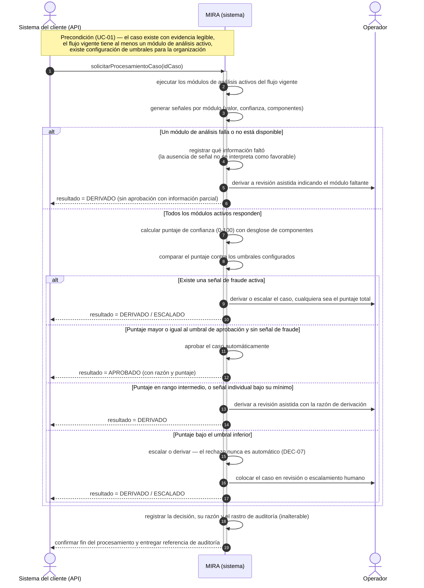

# DIAGRAMA DE SECUENCIA DE SISTEMA (SSD) — MIRA

Derivado de `CasosDeUso_MIRA.md` y verificado contra `requisitosFuncionales_y_NoFuncionales.md` y `ModeloDominio_MIRA.md`.

## Caso de uso modelado: UC-02 — Procesar caso automáticamente y decidir

**Criterio de selección (caso de uso más crítico):** UC-02 es el núcleo funcional de la plataforma.

- Concentra la mayor densidad de reglas de negocio y de decisiones críticas de la bitácora: aplica **DEC-04** (umbrales configurables) y **DEC-07** (el rechazo nunca es automático), da precedencia a las señales de fraude sobre el puntaje total, y prohíbe aprobar con información parcial cuando un módulo falla.
- De él se derivan ocho requisitos funcionales de prioridad Alta (**RF-07** a **RF-14**), varios con criterios de aceptación absolutos (`0%` / `100%`).
- Alimenta a todos los demás flujos —revisión asistida (UC-03), auditoría (UC-06), facturación (UC-10), paneles (UC-07)—: si su lógica falla, el error se propaga por toda la cadena.
- Es el flujo con más rutas alternativas de los 18 casos de uso.

**Alcance del diagrama:** el sistema (MIRA) se trata como caja negra. Los autollamados (`MIRA ->> MIRA`) no exponen diseño interno: solo ubican en qué punto de la secuencia se aplica cada regla de decisión. La resolución del caso por parte del operador cuando se deriva (aprobar, rechazar, solicitar antecedentes) es **UC-03** y se modela por separado.

## Diagrama (Mermaid)

## Participantes y convenciones

| Elemento | Significado |
|---|---|
| **Sistema del cliente (API)** | Actor que dispara el procesamiento y recibe el resultado del caso. |
| **MIRA (sistema)** | Caja negra. Los autollamados solo marcan dónde se aplica cada regla de decisión. |
| **Operador** | Recibe el caso cuando se deriva o escala. Su decisión sobre el caso es UC-03. |
| Flecha llena (`->>`) | Mensaje del actor al sistema, o procesamiento interno del sistema. |
| Flecha punteada (`-->>`) | Respuesta del sistema al actor. |
| `alt` / `else` | Ramas mutuamente excluyentes del flujo alternativo de UC-02. |

## Trazabilidad del diagrama

| Paso / rama | Mensaje en el diagrama | Fuente | RF / DEC |
|---|---|---|---|
| Precondición | Evidencia legible, ≥ 1 módulo activo, umbrales configurados | UC-01; UC-02 precond. | RF-02, RF-04 |
| 1 | `solicitarProcesamientoCaso(idCaso)` | Disparador de UC-02 | — |
| 2 | Ejecutar los módulos de análisis activos del flujo vigente | UC-02 paso 1 | RF-07 |
| 3 | Generar señales por módulo | UC-02 paso 2 | — |
| 6 | Calcular puntaje de confianza (0-100) con desglose | UC-02 paso 3 | RF-08 |
| 7 | Comparar el puntaje contra los umbrales configurados | UC-02 paso 4 | RF-09 |
| Rama · módulo caído | Derivar a revisión indicando qué información faltó | UC-02 flujo alt. | RF-13 |
| Rama · fraude activo | Derivar o escalar, cualquiera sea el puntaje total | UC-02 flujo alt. | RF-12 |
| Rama · puntaje alto | Aprobar el caso automáticamente | UC-02 paso 5 | RF-10 |
| Rama · rango intermedio | Derivar a revisión asistida con la razón de derivación | UC-02 flujo alt. | RF-11 |
| Rama · bajo el umbral inferior | Escalar o derivar — nunca rechazo automático | UC-02 flujo alt. | DEC-07, RF-14 |
| Cierre | Registrar decisión, razón y rastro de auditoría | UC-02 paso 6 | RF-06 |

## Notas de trazabilidad

- El diagrama cubre **solo UC-02**. La resolución del caso derivado por el operador corresponde a UC-03 y se modela aparte.
- La entrega del resultado se muestra síncrona. Si el cliente habilitó un canal de devolución (callback), aplica además **RF-50 / DEC-05** para contenido multimedia asincrónico.
- Los umbrales referidos (`umbralAprobacion`, `umbralDerivacion`, `umbralEscalamiento`) son los de la entidad `Umbral` del Modelo de Dominio; sus valores concretos los define cada organización (DEC-04).
- Consistente con la regla de `Caso`: "la plataforma nunca decide sin dejar constancia de los elementos que la sustentaron" — de ahí el registro de auditoría antes de cerrar el procesamiento.
