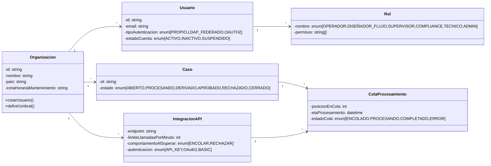
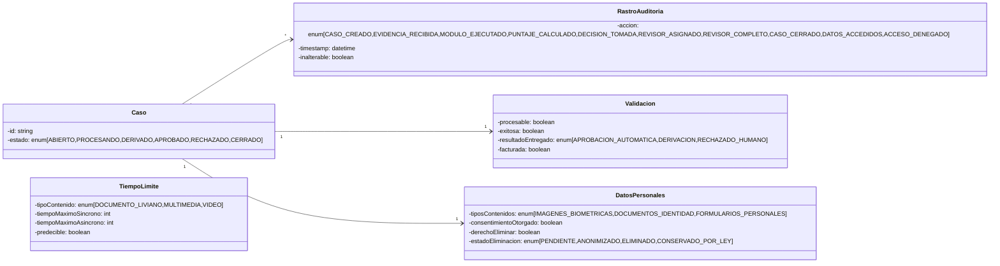

# MODELO DE DOMINIO - MIRA

## Diagrama de Clases (Mermaid)

**Nota de corrección:** esta versión corrige los errores de sintaxis detectados en la revisión (identificadores con espacios que rompían el parseo de Mermaid: `ColaProc esamiento`, `etaProce samiento`, `respetar LimiteRateLimit()`, `solicitar Eliminacion()`, `estadoColaFloat`, `dereoEliminar`) y dos inconsistencias semánticas con DEC-07: `Umbral.umbralRechazo` se renombró a `umbralEscalamiento`, y `Validacion.resultadoEntregado` cambió `RECHAZADO` por `RECHAZADO_HUMANO` para dejar explícito que ese resultado solo puede originarse en una decisión humana, nunca automática. Para mejorar la legibilidad, las 18 clases se agrupan visualmente en 5 subdominios mediante `namespace` de Mermaid.

```mermaid
classDiagram
    direction TB

    namespace Organizacion_y_Acceso {
        class Organizacion
        class Usuario
        class Rol
        class IntegracionAPI
    }

    namespace Gestion_de_Casos {
        class Caso
        class Evidencia
        class Flujo
        class Modulo
        class Señal
    }

    namespace Motor_de_Decision {
        class Puntaje
        class Umbral
        class Decision
        class RevisionAsistida
    }

    namespace Cumplimiento_y_Auditoria {
        class RastroAuditoria
        class Validacion
        class DatosPersonales
    }

    namespace Operacion_e_Infraestructura {
        class ColaProcesamiento
        class TiempoLimite
    }

    class Organizacion {
        -id: string
        -nombre: string
        -pais: string
        -fechaCreacion: datetime
        -tipoCliente: enum[ASEGURADOR,FINANCIERO,OTRO]
        -zonaHorariaMantenimiento: string
        +crearUsuario()
        +crearCaso()
        +definirUmbral()
        +consultarMetricas()
    }

    class Usuario {
        -id: string
        -email: string
        -nombre: string
        -tipoAutenticacion: enum[PROPIO,LDAP_FEDERADO,OAUTH2]
        -ultimoLogin: datetime
        -estadoCuenta: enum[ACTIVO,INACTIVO,SUSPENDIDO]
        +login()
        +logout()
        +cambiarPassword()
    }

    class Rol {
        -id: string
        -nombre: enum[OPERADOR,DISEÑADOR_FLUJO,SUPERVISOR,COMPLIANCE,TECNICO,ADMIN]
        -permisos: string[]
        +asignarPermiso()
        +revocarPermiso()
    }

    class IntegracionAPI {
        -id: string
        -organizacionId: Organizacion_id
        -endpoint: string
        -limiteLlamadasPorMinuto: int
        -comportamientoAlSuperar: enum[ENCOLAR,RECHAZAR]
        -autenticacion: enum[API_KEY,OAuth2,BASIC]
        -ultimaLlamada: datetime
        +procesarLlamada()
        +respetarLimiteRateLimit()
    }

    class Caso {
        -id: string
        -identificadorUnico: string
        -estado: enum[ABIERTO,PROCESANDO,DERIVADO,APROBADO,RECHAZADO,CERRADO]
        -fechaCreacion: datetime
        -fechaResolucion: datetime
        -plazoResolucion: int
        -tiempoRestante: int
        +recibirEvidencia()
        +reProcesarConEvidenciaAdicional()
        +cerrar()
    }

    class Evidencia {
        -id: string
        -tipo: enum[PDF,IMAGEN,VIDEO,AUDIO,CODIGO_BARRAS,QR]
        -nombre: string
        -tamaño: long
        -estado: enum[LEGIBLE,ILEGIBLE,CORRUPTA,PENDIENTE_ANALISIS]
        -fechaRecepcion: datetime
        -fechaEliminacion: datetime
        -cifrada: boolean
        -ubicacionAlmacenamiento: string
        -periodoRetencion: int
        +validarLegibilidad()
        +procesarConModulo()
    }

    class Flujo {
        -id: string
        -nombre: string
        -version: string
        -estado: enum[BORRADOR,TESTEO,PUBLICADO,DESCONTINUADO]
        -fechaCreacion: datetime
        -fechaPublicacion: datetime
        -modificadoPor: User_id
        -historialVersiones: Version[]
        +crearVersion()
        +testear()
        +publicar()
        +revertir()
    }

    class Modulo {
        -id: string
        -nombre: enum[LECTURA_OCR,DETECCION_ROSTROS,VALIDACION_FIRMAS,PRUEBA_VIDA,ANALISIS_VIDEO,EXTRACCION_CAMPOS,TRANSCRIPCION_AUDIO,VERIFICACION_IDENTIDAD,DETECCION_FRAUDE_DOCUMENTAL]
        -version: string
        -estado: enum[ACTIVO,INACTIVO,DEPRECADO]
        -proveedor: string
        -configuracion: json
        -ultimaActualizacion: datetime
        +ejecutar()
        +configurar()
        +actualizarVersion()
    }

    class Señal {
        -id: string
        -tipo: enum[AUTENTICIDAD_DOCUMENTO,COHERENCIA_BIOMETRICA,CRUCE_FUENTES,FRAUDE_ACTIVO,CALIDAD_IMAGEN,LEGIBILIDAD]
        -valor: float
        -confianza: float
        -descripcion: string
        -componentesDetectados: json
        -moduloOrigen: Modulo_id
        +calcular()
        +explicar()
    }

    class Puntaje {
        -id: string
        -valor: int
        -rangoMinimo: int
        -rangoMaximo: int
        -componentes: map[señal_tipo -> valor]
        -fechaCalculo: datetime
        -versionModulos: json
        -reproducible: boolean
        +calcular()
        +desglosar()
    }

    class Umbral {
        -id: string
        -nombreConfiguracion: string
        -umbralAprobacion: int
        -umbralDerivacion: int
        -umbralEscalamiento: int
        -estado: enum[ACTIVO,HISTORICO]
        -fechaCreacion: datetime
        -creadoPor: User_id
        -razonCambio: string
        -valorAnterior: json
        +definir()
        +modificar()
        +registrarCambio()
    }

    class Decision {
        -id: string
        -tipoDecision: enum[APROBACION_AUTOMATICA,DERIVACION_REVISION,RECHAZO_HUMANO,ESCALAMIENTO]
        -resultado: enum[APROBADO,RECHAZADO,DERIVADO,ESCALADO]
        -razon: string
        -basadoEnSeñales: Señal_id[]
        -basadoEnUmbral: Umbral_id
        -puntajeOrigen: Puntaje_id
        -reproducible: boolean
        -autorResponsable: User_id
        -fechaDecision: datetime
        +tomarDecision()
        +registrar()
        +justificar()
    }

    class RevisionAsistida {
        -id: string
        -estado: enum[ASIGNADA,EN_REVISION,COMPLETADA,VENCIDA]
        -operador: User_id
        -evidenciaVisualizada: Evidencia_id[]
        -razonDerivacion: string
        -puntajeOriginal: Puntaje_id
        -decisionOperador: Decision_id
        -acuerdonConPlataforma: boolean
        -tiempoGastado: int
        -fechaAsignacion: datetime
        -fechaCompletacion: datetime
        +asignar()
        +revisar()
        +marcarDesacuerdo()
    }

    class RastroAuditoria {
        -id: string
        -casoId: Caso_id
        -accion: enum[CASO_CREADO,EVIDENCIA_RECIBIDA,MODULO_EJECUTADO,PUNTAJE_CALCULADO,DECISION_TOMADA,REVISOR_ASIGNADO,REVISOR_COMPLETO,CASO_CERRADO,DATOS_ACCEDIDOS,ACCESO_DENEGADO]
        -actorResponsable: User_id
        -timestamp: datetime
        -detalles: json
        -versionModulo: string
        -versionFlujo: string
        -estadoAntes: string
        -estadoDespues: string
        -inalterable: boolean
        +registrar()
        +consultar()
        +exportar()
    }

    class Validacion {
        -id: string
        -casoId: Caso_id
        -procesable: boolean
        -exitosa: boolean
        -puntajeEntregado: boolean
        -resultadoEntregado: enum[APROBACION_AUTOMATICA,DERIVACION,RECHAZADO_HUMANO]
        -razonNoValidacion: string
        -fechaValidacion: datetime
        -facturada: boolean
        +contar()
        +verificarFacturabilidad()
    }

    class TiempoLimite {
        -id: string
        -tipoContenido: enum[DOCUMENTO_LIVIANO,MULTIMEDIA,VIDEO]
        -tiempoMaximoSincrono: int
        -tiempoMaximoAsincrono: int
        -tiempoPromedioPilotos: float
        -predecible: boolean
        +calcularSLA()
    }

    class ColaProcesamiento {
        -id: string
        -casoId: Caso_id
        -posicionEnCola: int
        -horaEncolado: datetime
        -etaProcesamiento: datetime
        -estadoCola: enum[ENCOLADO,PROCESANDO,COMPLETADO,ERROR]
        +encolar()
        +desencolar()
        +consultarPosicion()
    }

    class DatosPersonales {
        -id: string
        -casoId: Caso_id
        -tiposContenidos: enum[IMAGENES_BIOMETRICAS,DOCUMENTOS_IDENTIDAD,FORMULARIOS_PERSONALES]
        -consentimientoOtorgado: boolean
        -derechoEliminar: boolean
        -estadoEliminacion: enum[PENDIENTE,ANONIMIZADO,ELIMINADO,CONSERVADO_POR_LEY]
        -razonConservacion: string
        +solicitarEliminacion()
        +anonimizar()
        +verificarConsentimiento()
    }

    %% Relaciones
    Organizacion "1" --> "*" Usuario
    Organizacion "1" --> "*" Caso
    Organizacion "1" --> "*" Flujo
    Organizacion "1" --> "*" Umbral
    Organizacion "1" --> "*" IntegracionAPI

    Usuario "1" --> "*" Rol
    Usuario "1" --> "*" Decision
    Usuario "1" --> "*" RevisionAsistida
    Usuario "1" --> "*" RastroAuditoria

    Caso "1" --> "*" Evidencia
    Caso "1" --> "*" Señal
    Caso "1" --> "1" Puntaje
    Caso "1" --> "1" Decision
    Caso "0..1" --> "1" RevisionAsistida
    Caso "1" --> "*" RastroAuditoria
    Caso "1" --> "1" Validacion
    Caso "1" --> "*" ColaProcesamiento
    Caso "1" --> "1" DatosPersonales

    Evidencia "*" --> "1" Modulo
    Evidencia "1" --> "*" Señal

    Flujo "*" --> "*" Modulo

    Modulo "1" --> "*" Señal

    Puntaje "*" --> "*" Señal
    Puntaje "1" --> "1" Umbral

    Decision "1" --> "*" RastroAuditoria

    RevisionAsistida "1" --> "*" Evidencia
    RevisionAsistida "1" --> "1" Decision

    Validacion "1" --> "1" Caso
```



## Vistas por Subdominio (para presentación y lectura rápida)

El diagrama completo es la referencia técnica única; estas tres vistas recortan el mismo modelo (mismos nombres, tipos y cardinalidades, sin inventar nada nuevo) para que cada una se pueda proyectar o imprimir sin saturación visual.

### Vista A — Núcleo operativo del Caso

```mermaid
classDiagram
    direction LR

    class Caso {
        -id: string
        -identificadorUnico: string
        -estado: enum[ABIERTO,PROCESANDO,DERIVADO,APROBADO,RECHAZADO,CERRADO]
        -plazoResolucion: int
        -tiempoRestante: int
        +recibirEvidencia()
        +reProcesarConEvidenciaAdicional()
        +cerrar()
    }

    class Evidencia {
        -id: string
        -tipo: enum[PDF,IMAGEN,VIDEO,AUDIO,CODIGO_BARRAS,QR]
        -estado: enum[LEGIBLE,ILEGIBLE,CORRUPTA,PENDIENTE_ANALISIS]
        -periodoRetencion: int
        -cifrada: boolean
    }

    class Modulo {
        -id: string
        -nombre: enum[LECTURA_OCR,DETECCION_ROSTROS,VALIDACION_FIRMAS,PRUEBA_VIDA,ANALISIS_VIDEO,EXTRACCION_CAMPOS,TRANSCRIPCION_AUDIO,VERIFICACION_IDENTIDAD,DETECCION_FRAUDE_DOCUMENTAL]
        -version: string
        -estado: enum[ACTIVO,INACTIVO,DEPRECADO]
    }

    class Señal {
        -id: string
        -tipo: enum[AUTENTICIDAD_DOCUMENTO,COHERENCIA_BIOMETRICA,CRUCE_FUENTES,FRAUDE_ACTIVO,CALIDAD_IMAGEN,LEGIBILIDAD]
        -valor: float
        -confianza: float
    }

    class Puntaje {
        -id: string
        -valor: int
        -componentes: map[señal_tipo -> valor]
        -reproducible: boolean
    }

    class Umbral {
        -umbralAprobacion: int
        -umbralDerivacion: int
        -umbralEscalamiento: int
    }

    class Decision {
        -tipoDecision: enum[APROBACION_AUTOMATICA,DERIVACION_REVISION,RECHAZO_HUMANO,ESCALAMIENTO]
        -resultado: enum[APROBADO,RECHAZADO,DERIVADO,ESCALADO]
        -razon: string
    }

    class RevisionAsistida {
        -estado: enum[ASIGNADA,EN_REVISION,COMPLETADA,VENCIDA]
        -razonDerivacion: string
        -acuerdonConPlataforma: boolean
    }

    Caso "1" --> "*" Evidencia
    Caso "1" --> "*" Señal
    Caso "1" --> "1" Puntaje
    Caso "1" --> "1" Decision
    Caso "0..1" --> "1" RevisionAsistida
    Evidencia "*" --> "1" Modulo
    Evidencia "1" --> "*" Señal
    Modulo "1" --> "*" Señal
    Puntaje "*" --> "*" Señal
    Puntaje "1" --> "1" Umbral
    RevisionAsistida "1" --> "*" Evidencia
    RevisionAsistida "1" --> "1" Decision
```



### Vista B — Organización, Acceso e Integración



### Vista C — Cumplimiento, Auditoría y Facturación



## Glosario de Entidades - JSON

```json
{
  "entidades": {
    "Organizacion": {
      "descripcion": "Cliente de DPRIME dentro de la plataforma. Representa una empresa aseguradora, financiera u otro tipo que opera MIRA de forma aislada",
      "atributos": {
        "id": {
          "tipo": "string",
          "descripcion": "Identificador único de la organización",
          "requerido": true,
          "fuente": "DEC-02"
        },
        "nombre": {
          "tipo": "string",
          "descripcion": "Nombre legal de la organización cliente",
          "requerido": true
        },
        "pais": {
          "tipo": "string",
          "descripcion": "País donde opera el cliente (relevante para retención de datos y zona horaria)",
          "requerido": true,
          "fuente": "DEC-01, DEC-09"
        },
        "tipoCliente": {
          "tipo": "enum[ASEGURADOR, FINANCIERO, OTRO]",
          "descripcion": "Tipo de industria del cliente (impacta configuración de módulos y umbrales)",
          "requerido": true
        },
        "zonaHorariaMantenimiento": {
          "tipo": "string",
          "descripcion": "Zona horaria donde se ejecutarán ventanas de mantenimiento coordinadas",
          "requerido": true,
          "fuente": "DEC-09"
        }
      },
      "restricciones": "Cada cliente es completamente aislado. Un cliente NUNCA puede ver datos de otro.",
      "relacionadasCon": ["Usuario", "Caso", "Flujo", "Umbral"]
    },

    "Usuario": {
      "descripcion": "Persona que interactúa con la plataforma. Puede ser operador de casos, diseñador de flujos, supervisor, o administrador",
      "atributos": {
        "id": {
          "tipo": "string",
          "descripcion": "Identificador único del usuario dentro de su organización",
          "requerido": true
        },
        "email": {
          "tipo": "string",
          "descripcion": "Correo electrónico único del usuario",
          "requerido": true
        },
        "nombre": {
          "tipo": "string",
          "descripcion": "Nombre completo del usuario",
          "requerido": true
        },
        "tipoAutenticacion": {
          "tipo": "enum[PROPIO, LDAP_FEDERADO, OAUTH2]",
          "descripcion": "Método de autenticación. PROPIO = usuarios creados en MIRA. LDAP_FEDERADO = contra directorio corporativo del cliente",
          "requerido": true,
          "fuente": "DEC-08",
          "nota": "En Entrega 1-3 solo PROPIO. LDAP_FEDERADO será soporte en Entrega 4 (abril 2027)"
        },
        "ultimoLogin": {
          "tipo": "datetime",
          "descripcion": "Marca temporal del último login exitoso",
          "requerido": false
        },
        "estadoCuenta": {
          "tipo": "enum[ACTIVO, INACTIVO, SUSPENDIDO]",
          "descripcion": "Estado actual de la cuenta del usuario",
          "requerido": true
        }
      },
      "operaciones": {
        "login": "Autenticar usuario (propio o federado)",
        "logout": "Cerrar sesión",
        "cambiarPassword": "Solo si tipoAutenticacion = PROPIO"
      },
      "restricciones": "Usuario pertenece a exactamente UNA organización. Un usuario con Rol=OPERADOR no puede modificar umbrales",
      "relacionadasCon": ["Rol", "Organizacion", "Decision", "RevisionAsistida"]
    },

    "Rol": {
      "descripcion": "Define permisos y responsabilidades de un usuario dentro de su organización",
      "atributos": {
        "id": {
          "tipo": "string",
          "descripcion": "Identificador único del rol",
          "requerido": true
        },
        "nombre": {
          "tipo": "enum[OPERADOR, DISEÑADOR_FLUJO, SUPERVISOR, COMPLIANCE, TECNICO, ADMIN]",
          "descripcion": "Rol predefinido con permisos específicos",
          "requerido": true,
          "fuente": "Cap 2.13",
          "detalles": {
            "OPERADOR": "Resuelve casos en bandeja de revisión asistida",
            "DISEÑADOR_FLUJO": "Crea y modifica flujos sin código",
            "SUPERVISOR": "Ve métricas y tendencias, NO casos individuales",
            "COMPLIANCE": "Aprueba cambios de umbral, ve auditorías",
            "TECNICO": "Integra MIRA con sistemas cliente, gestiona API",
            "ADMIN": "Administra usuarios, cuenta, billing"
          }
        },
        "permisos": {
          "tipo": "string[]",
          "descripcion": "Lista de permisos otorgados por este rol",
          "requerido": true
        }
      },
      "restricciones": "Cambios de umbral requieren mínimo 2 aprobaciones (COMPLIANCE + DISEÑADOR_FLUJO)",
      "fuente": "DEC-04"
    },

    "Caso": {
      "descripcion": "Unidad de trabajo de la plataforma. Agrupa toda la evidencia recibida sobre un mismo hecho y la decisión tomada",
      "atributos": {
        "id": {
          "tipo": "string",
          "descripcion": "ID único, permanente e inmutable del caso, generado automáticamente por plataforma",
          "requerido": true,
          "fuente": "Cap 3 Comportamiento Esperado"
        },
        "identificadorUnico": {
          "tipo": "string",
          "descripcion": "Se mantiene aunque el caso se reevalúe con evidencia adicional",
          "requerido": true
        },
        "estado": {
          "tipo": "enum[ABIERTO, PROCESANDO, DERIVADO, APROBADO, RECHAZADO, CERRADO]",
          "descripcion": "Estado actual del caso en su ciclo de vida",
          "requerido": true,
          "transiciones": "ABIERTO -> PROCESANDO -> (APROBADO | RECHAZADO | DERIVADO) -> CERRADO"
        },
        "plazoResolucion": {
          "tipo": "int",
          "descripcion": "Días hábiles comprometidos con asegurado para resolver el caso",
          "requerido": true,
          "ejemplo": "3 días para reembolsos médicos"
        },
        "tiempoRestante": {
          "tipo": "int",
          "descripcion": "Días hábiles restantes antes de vencer el plazo. Alertar si está por vencer",
          "requerido": false,
          "fuente": "DEC-02"
        }
      },
      "reglas_negocio": [
        "Ningún caso puede quedar sin resolución",
        "Un caso aprobado automáticamente no vuelve a revisarse",
        "Si llega evidencia nueva sobre caso cerrado, se abre un caso nuevo vinculado",
        "La plataforma nunca decide sin dejar constancia de elementos que sustentaron",
        "Cuando un módulo falla, el caso NO se aprueba con información parcial: se deriva a revisión"
      ],
      "relacionadasCon": ["Evidencia", "Señal", "Puntaje", "Decision", "RevisionAsistida", "Validacion"]
    },

    "Evidencia": {
      "descripcion": "Cualquier archivo aportado sobre un caso: documento, fotografía, video, audio o código impreso",
      "atributos": {
        "id": {
          "tipo": "string",
          "descripcion": "Identificador único de la pieza de evidencia",
          "requerido": true
        },
        "tipo": {
          "tipo": "enum[PDF, IMAGEN, VIDEO, AUDIO, CODIGO_BARRAS, QR]",
          "descripcion": "Tipo de archivo",
          "requerido": true
        },
        "estado": {
          "tipo": "enum[LEGIBLE, ILEGIBLE, CORRUPTA, PENDIENTE_ANALISIS]",
          "descripcion": "Validación de legibilidad. La plataforma DEBE verificar antes de analizar",
          "requerido": true,
          "fuente": "Cap 2.4"
        },
        "periodoRetencion": {
          "tipo": "int",
          "descripcion": "Años que se conserva la evidencia. DECISION: 5 años mínimo (fue 90 días)",
          "requerido": true,
          "fuente": "DEC-01",
          "valor_default": 5
        },
        "cifrada": {
          "tipo": "boolean",
          "descripcion": "Almacenada cifrada tanto en tránsito como en reposo",
          "requerido": true,
          "fuente": "DEC-01"
        },
        "ubicacionAlmacenamiento": {
          "tipo": "string",
          "descripcion": "Localización del almacenamiento (para cumplir requisito de datos en territorio nacional)",
          "requerido": true
        }
      },
      "restricciones": [
        "Ninguna pieza de evidencia se elimina mientras exista un caso abierto que dependa de ella",
        "Evidencia de un caso solo puede ser vista por usuarios de esa organización",
        "Personal de DPRIME accede a evidencia SOLO con autorización expresa y registrada del cliente"
      ],
      "relacionadasCon": ["Caso", "Señal", "RevisionAsistida", "DatosPersonales"]
    },

    "Flujo": {
      "descripcion": "Secuencia configurada de ingesta, análisis, reglas y decisión que un cliente define para su proceso",
      "atributos": {
        "id": {
          "tipo": "string",
          "descripcion": "Identificador único del flujo",
          "requerido": true
        },
        "nombre": {
          "tipo": "string",
          "descripcion": "Nombre descriptivo del flujo. Ej: 'Reembolso Gastos Médicos', 'Siniestro Automotriz'",
          "requerido": true
        },
        "version": {
          "tipo": "string",
          "descripcion": "Versión actual (Ej: 1.0, 1.1, 2.0). Versionamiento obligatorio",
          "requerido": true,
          "fuente": "Cap 2.8"
        },
        "estado": {
          "tipo": "enum[BORRADOR, TESTEO, PUBLICADO, DESCONTINUADO]",
          "descripcion": "Estado del flujo en su ciclo de vida",
          "requerido": true
        }
      },
      "reglas_negocio": [
        "Un flujo publicado no puede modificarse en producción: se crea versión nueva",
        "Los casos en curso terminan con versión con que empezaron",
        "Un flujo sin al menos un módulo de análisis activo NO puede publicarse",
        "El cliente adapta en vez de construir desde cero (usa plantillas por industria)"
      ],
      "operaciones": {
        "crearVersion": "Crear nueva versión sin afectar la vigente",
        "testear": "Ejecutar sobre casos de ejemplo antes de publicar",
        "publicar": "Hacer disponible en producción (genera cambios disponibles en segundos)",
        "revertir": "Volver a versión anterior"
      },
      "fuente": "Cap 2.8, DEC-04",
      "relacionadasCon": ["Modulo", "Umbral"]
    },

    "Modulo": {
      "descripcion": "Capacidad de análisis activable de forma independiente dentro de un flujo. Representa servicios de terceros o motores propios",
      "atributos": {
        "id": {
          "tipo": "string",
          "descripcion": "Identificador único del módulo",
          "requerido": true
        },
        "nombre": {
          "tipo": "enum[LECTURA_OCR, DETECCION_ROSTROS, VALIDACION_FIRMAS, PRUEBA_VIDA, ANALISIS_VIDEO, EXTRACCION_CAMPOS, TRANSCRIPCION_AUDIO, VERIFICACION_IDENTIDAD, DETECCION_FRAUDE_DOCUMENTAL]",
          "descripcion": "Tipo de análisis que ejecuta el módulo",
          "requerido": true,
          "nota": "Cap 2.5 describe 6 modalidades de señal"
        },
        "version": {
          "tipo": "string",
          "descripcion": "Versión del módulo (Ej: 1.2, 2.0). Cambios de versión impactan decisiones",
          "requerido": true,
          "fuente": "DEC-05"
        },
        "proveedor": {
          "tipo": "string",
          "descripcion": "Proveedor externo (OpenAI, AWS Rekognition, etc.) o 'DPRIME_PROPIO'",
          "requerido": false,
          "fuente": "Cap 4 - 'depende de servicios de terceros'"
        },
        "estado": {
          "tipo": "enum[ACTIVO, INACTIVO, DEPRECADO]",
          "descripcion": "Estado de disponibilidad del módulo",
          "requerido": true
        }
      },
      "reglas_negocio": [
        "Cada flujo está clavado a una versión específica de cada módulo",
        "Actualizar módulo es decisión consciente del cliente, con comparación previa",
        "Un módulo nuevo o actualizado no puede alterar comportamiento de flujo en producción sin autorización",
        "Panel debe mostrar: qué módulos están activos, en qué versión, con qué configuración"
      ],
      "fuente": "Cap 2.9, DEC-05",
      "relacionadasCon": ["Flujo", "Evidencia", "Señal"]
    },

    "Señal": {
      "descripcion": "Resultado individual producido por un módulo de análisis sobre una pieza de evidencia o sobre el conjunto. Componente básico del puntaje",
      "atributos": {
        "id": {
          "tipo": "string",
          "descripcion": "Identificador único de la señal",
          "requerido": true
        },
        "tipo": {
          "tipo": "enum[AUTENTICIDAD_DOCUMENTO, COHERENCIA_BIOMETRICA, CRUCE_FUENTES, FRAUDE_ACTIVO, CALIDAD_IMAGEN, LEGIBILIDAD]",
          "descripcion": "Categoría de la señal. Puede tener componentes individuales",
          "requerido": true,
          "fuente": "Cap 2.5"
        },
        "valor": {
          "tipo": "float",
          "descripcion": "Valor numérico de la señal (escala y unidades no_encontrado)",
          "requerido": true,
          "nota": "No especificado en documentación: escala, unidades"
        },
        "confianza": {
          "tipo": "float",
          "descripcion": "Nivel de confianza del resultado (0-1 o 0-100, no_encontrado)",
          "requerido": true,
          "nota": "No especificado en documentación"
        },
        "componentesDetectados": {
          "tipo": "json",
          "descripcion": "Detalles específicos detectados (Ej: si es fraude, qué tipo; si es rostro, qué coordenadas)",
          "requerido": false,
          "fuente": "Cap 2.5"
        },
        "moduloOrigen": {
          "tipo": "Modulo_id",
          "descripcion": "Qué módulo generó esta señal",
          "requerido": true
        }
      },
      "reglas_negocio": [
        "Las señales de fraude tienen precedencia sobre el puntaje total",
        "Un caso con una señal de fraude activa se deriva o escala, cualquiera sea su puntaje",
        "Cuando un módulo falla, la ausencia de su señal NO se interpreta como señal favorable"
      ],
      "fuente": "Cap 2.6, DEC-07",
      "relacionadasCon": ["Modulo", "Puntaje", "Evidencia"]
    },

    "Puntaje": {
      "descripcion": "Valor entre 0 y 100 que resume las señales de un caso y sobre el cual se aplica la decisión. Acompañado de sus componentes",
      "atributos": {
        "id": {
          "tipo": "string",
          "descripcion": "Identificador único del puntaje",
          "requerido": true
        },
        "valor": {
          "tipo": "int",
          "descripcion": "Puntuación final entre 0-100",
          "requerido": true,
          "fuente": "DEC-04"
        },
        "componentes": {
          "tipo": "map[string -> float]",
          "descripcion": "Desglose: qué señales empujaron el puntaje hacia arriba o abajo",
          "requerido": true,
          "ejemplo": "{autenticidad: 85, biometria: 70, cruce_fuentes: 90}",
          "fuente": "DEC-03"
        },
        "versionModulos": {
          "tipo": "json",
          "descripcion": "Versiones de módulos usadas para calcular este puntaje (para reproducibilidad)",
          "requerido": true,
          "fuente": "Cap 3"
        },
        "reproducible": {
          "tipo": "boolean",
          "descripcion": "¿Puede reproducirse este puntaje ejecutando los mismos módulos? (Falso si modelos generativos son no deterministas)",
          "requerido": true,
          "fuente": "DEC-05, Cap 3",
          "nota": "Modelos generativos: no hay garantía de reproducibilidad exacta"
        }
      },
      "reglas_negocio": [
        "Puntaje debe acompañarse SIEMPRE de componentes",
        "Cuando puntaje sea suficiente PERO alguna señal individual está bajo su mínimo, caso se deriva a revisión",
        "No existe puntaje único sin desglose: mostrar siempre qué empuja hacia arriba/abajo"
      ],
      "restricciones": "Determinismo: modelos generativos pueden dar resultados ligeramente distintos en ejecuciones posteriores",
      "fuente": "Cap 2.6, DEC-03, DEC-05",
      "relacionadasCon": ["Señal", "Caso", "Umbral", "Decision"]
    },

    "Umbral": {
      "descripcion": "Valor de puntaje a partir del cual corresponde una decisión determinada. Definido por cliente, configurable sin código",
      "atributos": {
        "id": {
          "tipo": "string",
          "descripcion": "Identificador único del umbral",
          "requerido": true
        },
        "nombreConfiguracion": {
          "tipo": "string",
          "descripcion": "Nombre descriptivo (Ej: 'Reembolso Conservador', 'Siniestro Agresivo')",
          "requerido": true
        },
        "umbralAprobacion": {
          "tipo": "int",
          "descripcion": "Puntaje a partir del cual se APRUEBA automáticamente. DECISION: 90 mínimo (fue 85)",
          "requerido": true,
          "fuente": "DEC-04",
          "rango": "0-100",
          "valor_sugerido": 90
        },
        "umbralDerivacion": {
          "tipo": "int",
          "descripcion": "Rango donde se DERIVA a revisión humana",
          "requerido": true,
          "fuente": "DEC-04",
          "rango": "0-100",
          "valor_sugerido_min": 60,
          "valor_sugerido_max": 89
        },
        "umbralEscalamiento": {
          "tipo": "int",
          "descripcion": "Puntaje bajo el cual el caso se escala o deriva a revisión humana. Nunca implica rechazo automático",
          "requerido": true,
          "fuente": "DEC-07",
          "rango": "0-100",
          "valor_sugerido": 20,
          "nota": "Rechazo SIEMPRE requiere intervención humana (DEC-07)"
        },
        "creadoPor": {
          "tipo": "User_id",
          "descripcion": "Usuario que creó esta configuración de umbral",
          "requerido": true,
          "fuente": "DEC-04"
        },
        "razonCambio": {
          "tipo": "string",
          "descripcion": "Justificación del cambio (auditable)",
          "requerido": false,
          "fuente": "DEC-04"
        }
      },
      "reglas_negocio": [
        "Los umbrales los define el cliente",
        "Cambio de umbral = cambio de política de riesgo, requiere 2 aprobaciones (COMPLIANCE + DISEÑADOR)",
        "Todo cambio queda registrado con autor, fecha, valor anterior",
        "Umbrales son por cliente y por tipo de proceso (pueden variar por flujo)"
      ],
      "fuente": "Cap 2.6, DEC-04",
      "relacionadasCon": ["Caso", "Puntaje", "Decision"]
    },

    "Decision": {
      "descripcion": "Resultado de aplicar umbral a puntaje. Puede ser automática (aprobación) o requerir intervención humana (derivación, rechazo)",
      "atributos": {
        "id": {
          "tipo": "string",
          "descripcion": "Identificador único de la decisión",
          "requerido": true
        },
        "tipoDecision": {
          "tipo": "enum[APROBACION_AUTOMATICA, DERIVACION_REVISION, RECHAZO_HUMANO, ESCALAMIENTO]",
          "descripcion": "Tipo de decisión tomada",
          "requerido": true,
          "fuente": "DEC-07"
        },
        "resultado": {
          "tipo": "enum[APROBADO, RECHAZADO, DERIVADO, ESCALADO]",
          "descripcion": "Resultado final del caso tras esta decisión",
          "requerido": true
        },
        "razon": {
          "tipo": "string",
          "descripcion": "Explicación clara y legible (para humano no técnico) de POR QUÉ se tomó esta decisión",
          "requerido": true,
          "fuente": "Cap 2.7"
        },
        "basadoEnSeñales": {
          "tipo": "Señal_id[]",
          "descripcion": "Qué señales impulsaron esta decisión",
          "requerido": true
        },
        "basadoEnUmbral": {
          "tipo": "Umbral_id",
          "descripcion": "Qué configuración de umbral se aplicó",
          "requerido": true
        },
        "autorResponsable": {
          "tipo": "User_id",
          "descripcion": "Usuario que tomó o aprobó la decisión (para auditoría)",
          "requerido": false,
          "nota": "Automática: null. Humana: User_id del operador"
        },
        "reproducible": {
          "tipo": "boolean",
          "descripcion": "¿Puede reproducirse esta decisión ejecutando con los mismos datos?",
          "requerido": true,
          "fuente": "Cap 3"
        }
      },
      "reglas_negocio": [
        "Aprobación automática: solo si puntaje >= umbral Y no hay señal de fraude activa",
        "Rechazo: SIEMPRE requiere intervención humana (prohibido automático)",
        "Derivación: cuando puntaje cae en rango intermedio O alguna señal está bajo su mínimo",
        "La plataforma nunca decide sin dejar constancia justificable"
      ],
      "fuente": "Cap 2.6, DEC-07",
      "relacionadasCon": ["Puntaje", "Umbral", "Caso", "RevisionAsistida"]
    },

    "RevisionAsistida": {
      "descripcion": "Intervención de un operador humano sobre un caso que la plataforma no resolvió automáticamente. Pieza crítica de la UX",
      "atributos": {
        "id": {
          "tipo": "string",
          "descripcion": "Identificador único de la revisión asistida",
          "requerido": true
        },
        "estado": {
          "tipo": "enum[ASIGNADA, EN_REVISION, COMPLETADA, VENCIDA]",
          "descripcion": "Estado del trabajo del operador",
          "requerido": true
        },
        "operador": {
          "tipo": "User_id",
          "descripcion": "Usuario (OPERADOR role) asignado a revisar este caso",
          "requerido": true
        },
        "razonDerivacion": {
          "tipo": "string",
          "descripcion": "POR QUÉ se derivó a humano (Ej: 'puntaje 72, incoherencia en montos'). CRÍTICO para operador",
          "requerido": true,
          "fuente": "Cap 2.7, DEC-03"
        },
        "puntajeOriginal": {
          "tipo": "Puntaje_id",
          "descripcion": "Puntaje que generó esta derivación",
          "requerido": true
        },
        "decisionOperador": {
          "tipo": "Decision_id",
          "descripcion": "Decisión final del operador (aprobación, rechazo, solicitud de antecedentes)",
          "requerido": true
        },
        "acuerdonConPlataforma": {
          "tipo": "boolean",
          "descripcion": "¿La decisión humana coincide con lo que la plataforma sugería?",
          "requerido": true,
          "fuente": "Cap 3"
        },
        "tiempoGastado": {
          "tipo": "int",
          "descripcion": "Minutos que tardó el operador en revisar (para métricas de productividad)",
          "requerido": false
        }
      },
      "reglas_negocio": [
        "Operador DEBE ver: evidencia, puntaje, desglose de señales, RAZÓN de derivación (todo en una pantalla)",
        "Puntaje se muestra al FINAL, no al inicio (para evitar sesgo de anclamiento)",
        "Cuando operador contradice plataforma, caso queda marcado para revisión de modelos",
        "Caso derivado debe resolverse dentro del plazo comprometido con asegurado"
      ],
      "fuente": "Cap 2.7, DEC-03",
      "relacionadasCon": ["Caso", "Usuario", "Evidencia", "Puntaje", "Decision"]
    },

    "RastroAuditoria": {
      "descripcion": "Registro completo e INALTERABLE de TODO lo ocurrido sobre un caso. Documento probatorio para auditoría regulatoria",
      "atributos": {
        "id": {
          "tipo": "string",
          "descripcion": "Identificador único del evento de auditoría",
          "requerido": true
        },
        "casoId": {
          "tipo": "Caso_id",
          "descripcion": "A qué caso corresponde este evento",
          "requerido": true
        },
        "accion": {
          "tipo": "enum[CASO_CREADO, EVIDENCIA_RECIBIDA, MODULO_EJECUTADO, PUNTAJE_CALCULADO, DECISION_TOMADA, REVISOR_ASIGNADO, REVISOR_COMPLETO, CASO_CERRADO, DATOS_ACCEDIDOS, ACCESO_DENEGADO]",
          "descripcion": "Qué acción ocurrió",
          "requerido": true
        },
        "actorResponsable": {
          "tipo": "User_id",
          "descripcion": "Quién ejecutó la acción (usuario o sistema)",
          "requerido": false
        },
        "timestamp": {
          "tipo": "datetime",
          "descripcion": "Cuándo ocurrió la acción",
          "requerido": true
        },
        "versionModulo": {
          "tipo": "string",
          "descripcion": "Versión del módulo que se ejecutó (para reconstrucción)",
          "requerido": false
        },
        "versionFlujo": {
          "tipo": "string",
          "descripcion": "Versión del flujo vigente en ese momento",
          "requerido": false
        },
        "inalterable": {
          "tipo": "boolean",
          "descripcion": "Este registro NUNCA puede modificarse ni eliminarse",
          "requerido": true,
          "valor_default": true
        }
      },
      "reglas_negocio": [
        "Rastro es INALTERABLE: nadie, ni ADMIN ni DPRIME, puede modificarlo",
        "Debe ser posible reconstruir una decisión pasada tal como se tomó (con versiones vigentes)",
        "Personal de DPRIME accede a auditoría SOLO con autorización expresa registrada del cliente",
        "El acceso a evidencia queda registrado (quién vio qué, cuándo)"
      ],
      "fuente": "Cap 2.11, DEC-01",
      "relacionadasCon": ["Caso", "Usuario", "Modulo", "Flujo"]
    },

    "Validacion": {
      "descripcion": "Unidad de consumo sobre la cual se factura el uso de la plataforma. Definición crítica para modelo de ingresos",
      "atributos": {
        "id": {
          "tipo": "string",
          "descripcion": "Identificador único de la validación",
          "requerido": true
        },
        "casoId": {
          "tipo": "Caso_id",
          "descripcion": "A qué caso corresponde esta validación",
          "requerido": true
        },
        "procesable": {
          "tipo": "boolean",
          "descripcion": "¿La evidencia era legible y procesable?",
          "requerido": true
        },
        "exitosa": {
          "tipo": "boolean",
          "descripcion": "¿Se completó el análisis sin errores?",
          "requerido": true
        },
        "puntajeEntregado": {
          "tipo": "boolean",
          "descripcion": "¿La plataforma entregó puntaje?",
          "requerido": true,
          "fuente": "DEC-02"
        },
        "resultadoEntregado": {
          "tipo": "enum[APROBACION_AUTOMATICA, DERIVACION, RECHAZADO_HUMANO]",
          "descripcion": "Tipo de resultado entregado",
          "requerido": true,
          "fuente": "DEC-02"
        },
        "razonNoValidacion": {
          "tipo": "string",
          "descripcion": "Si no fue validación cobrable, por qué (Ej: 'evidencia ilegible')",
          "requerido": false
        },
        "facturada": {
          "tipo": "boolean",
          "descripcion": "¿Esta validación fue facturada al cliente?",
          "requerido": true
        }
      },
      "reglas_negocio": [
        "DECISION: Validación = caso procesado exitosamente donde plataforma entregó resultado con puntaje, independientemente de si fue automático, derivado o rechazo por humano",
        "NO se cobra: casos con evidencia ilegible/no procesable",
        "Reintentos por error interno de plataforma NO se contabilizan",
        "Contador es visible en tiempo real para cliente y para DPRIME (mismo número)"
      ],
      "fuente": "DEC-02",
      "relacionadasCon": ["Caso"]
    },

    "TiempoLimite": {
      "descripcion": "Especificación de tiempos máximos de procesamiento por tipo de contenido (decisión arquitectónica)",
      "atributos": {
        "tipoContenido": {
          "tipo": "enum[DOCUMENTO_LIVIANO, MULTIMEDIA, VIDEO]",
          "descripcion": "Categoría de contenido",
          "requerido": true,
          "fuente": "DEC-05"
        },
        "tiempoMaximoSincrono": {
          "tipo": "int",
          "descripcion": "Segundos máximos para respuesta sincrónica",
          "requerido": true,
          "valor_sugerido_documento": 5,
          "fuente": "DEC-05"
        },
        "tiempoMaximoAsincrono": {
          "tipo": "int",
          "descripcion": "Minutos máximos para respuesta asincrónica (via callback)",
          "requerido": true,
          "fuente": "DEC-05"
        },
        "predecible": {
          "tipo": "boolean",
          "descripcion": "¿El tiempo es predecible o variable? DECISION: predecibilidad > velocidad pura",
          "requerido": true,
          "valor_default": true,
          "fuente": "DEC-05"
        }
      },
      "fuente": "DEC-05"
    },

    "ColaProcesamiento": {
      "descripcion": "Gestión de casos cuando se supera rate limit de API o hay picos de carga",
      "atributos": {
        "casoId": {
          "tipo": "Caso_id",
          "descripcion": "Caso encolado",
          "requerido": true
        },
        "posicionEnCola": {
          "tipo": "int",
          "descripcion": "Posición actual en la cola FIFO",
          "requerido": true
        },
        "horaEncolado": {
          "tipo": "datetime",
          "descripcion": "Cuándo llegó a la cola",
          "requerido": true
        },
        "etaProcesamiento": {
          "tipo": "datetime",
          "descripcion": "Estimado de cuándo se procesará",
          "requerido": false
        },
        "estadoCola": {
          "tipo": "enum[ENCOLADO, PROCESANDO, COMPLETADO, ERROR]",
          "descripcion": "Estado actual en la cola",
          "requerido": true,
          "fuente": "DEC-06"
        }
      },
      "reglas_negocio": [
        "Cuando se supera rate limit (100/min integracion, 1000/min produccion), casos se encolan",
        "NO se rechazan llamadas (DECISION: encolar, no rechazar)",
        "FIFO: primero en entrar, primero en procesar",
        "Cliente recibe ACK inmediato con posición en cola"
      ],
      "fuente": "DEC-06",
      "relacionadasCon": ["Caso", "IntegracionAPI"]
    },

    "IntegracionAPI": {
      "descripcion": "Definición de cómo un cliente integra con MIRA vía interfaz de programación",
      "atributos": {
        "id": {
          "tipo": "string",
          "descripcion": "Identificador único del punto de acceso API",
          "requerido": true
        },
        "organizacionId": {
          "tipo": "Organizacion_id",
          "descripcion": "A qué cliente pertenece esta integración",
          "requerido": true
        },
        "endpoint": {
          "tipo": "string",
          "descripcion": "URL del endpoint de la API",
          "requerido": true
        },
        "limiteLlamadasPorMinuto": {
          "tipo": "int",
          "descripcion": "Límite de rate limit (integracion: 100, produccion: 1000)",
          "requerido": true,
          "fuente": "DEC-06"
        },
        "comportamientoAlSuperar": {
          "tipo": "enum[ENCOLAR, RECHAZAR]",
          "descripcion": "DECISION: siempre ENCOLAR",
          "requerido": true,
          "valor_default": "ENCOLAR",
          "fuente": "DEC-06"
        },
        "autenticacion": {
          "tipo": "enum[API_KEY, OAuth2, BASIC]",
          "descripcion": "Tipo de autenticación del cliente",
          "requerido": true
        }
      },
      "fuente": "Cap 2.10, DEC-06",
      "relacionadasCon": ["Organizacion", "Caso", "ColaProcesamiento"]
    },

    "DatosPersonales": {
      "descripcion": "Gestión de datos personales y derechos del titular según RGPD y normativa local",
      "atributos": {
        "id": {
          "tipo": "string",
          "descripcion": "Identificador único",
          "requerido": true
        },
        "casoId": {
          "tipo": "Caso_id",
          "descripcion": "Caso que contiene estos datos personales",
          "requerido": true
        },
        "tiposContenidos": {
          "tipo": "enum[IMAGENES_BIOMETRICAS, DOCUMENTOS_IDENTIDAD, FORMULARIOS_PERSONALES]",
          "descripcion": "Tipos de datos personales contenidos",
          "requerido": true
        },
        "consentimientoOtorgado": {
          "tipo": "boolean",
          "descripcion": "¿Existe consentimiento del titular para procesar?",
          "requerido": true
        },
        "derechoEliminar": {
          "tipo": "boolean",
          "descripcion": "¿El titular ha ejercido derecho a ser olvidado?",
          "requerido": true
        },
        "estadoEliminacion": {
          "tipo": "enum[PENDIENTE, ANONIMIZADO, ELIMINADO, CONSERVADO_POR_LEY]",
          "descripcion": "Estado del cumplimiento del derecho",
          "requerido": true
        },
        "razonConservacion": {
          "tipo": "string",
          "descripcion": "Si se conserva por ley, cuál es la razón (auditable)",
          "requerido": false,
          "fuente": "DEC-01"
        }
      },
      "reglas_negocio": [
        "Datos personales contenidos en evidencia se tratan conforme normativa aplicable",
        "Cliente decide qué se hace: se elimina cuando titular lo solicita, con excepciones por obligación legal",
        "Rastro de auditoría es inalterable, pero datos personales en él pueden anonimizarse",
        "Imágenes biométricas reciben tratamiento más restrictivo: acceso limitado, plazo conservación propio, registro de cada consulta"
      ],
      "fuente": "Cap 4, DEC-01",
      "relacionadasCon": ["Caso", "Evidencia"]
    }
  },

  "decisiones_criticas": {
    "DEC-01": {
      "titulo": "Retención de Evidencia",
      "impacta_entidades": ["Evidencia", "RastroAuditoria", "DatosPersonales"],
      "cambio": "90 días → 5 años mínimo",
      "razon": "Requisito legal para auditoría regulatoria"
    },
    "DEC-02": {
      "titulo": "Definición de Validación Cobrable",
      "impacta_entidades": ["Validacion", "Caso"],
      "cambio": "¿Qué se cobra? → Caso procesado exitosamente con resultado y puntaje",
      "razon": "Modelo de ingresos por resultado"
    },
    "DEC-03": {
      "titulo": "Visualización del Puntaje",
      "impacta_entidades": ["RevisionAsistida", "Puntaje"],
      "cambio": "Mostrar puntaje primero → Mostrar al final",
      "razon": "Evitar sesgos de anclamiento en decisión humana"
    },
    "DEC-04": {
      "titulo": "Umbrales de Decisión",
      "impacta_entidades": ["Umbral", "Decision"],
      "cambio": "85 → 90 mínimo sugerido",
      "razon": "Conservadurismo inicial en marcha blanca"
    },
    "DEC-05": {
      "titulo": "Tiempos de Procesamiento",
      "impacta_entidades": ["TiempoLimite", "Caso", "ColaProcesamiento"],
      "cambio": "Sincrónico 5 seg → Híbrido (sincrónico livianos, asincrónico multimedia)",
      "razon": "Realidad de tiempos de análisis multimodal"
    },
    "DEC-06": {
      "titulo": "Rate Limit",
      "impacta_entidades": ["ColaProcesamiento", "IntegracionAPI"],
      "cambio": "Rechazar → Encolar",
      "razon": "Preservar integridad de datos en picos de carga"
    },
    "DEC-07": {
      "titulo": "Prohibición de Rechazos Automáticos",
      "impacta_entidades": ["Decision", "RevisionAsistida"],
      "cambio": "Rechazo automático permitido → PROHIBIDO",
      "razon": "Cumplimiento legal: decisiones adversas requieren intervención humana"
    },
    "DEC-08": {
      "titulo": "Autenticación Federada",
      "impacta_entidades": ["Usuario", "Rol"],
      "cambio": "Solo usuarios propios → Soporte LDAP/AD",
      "razon": "Requisito de clientes enterprise"
    },
    "DEC-09": {
      "titulo": "Mantenimiento 24/7",
      "impacta_entidades": ["Organizacion", "ColaProcesamiento"],
      "cambio": "Ventana nocturna única → Coordinada por zona + encuela",
      "razon": "Operación multi-regional global"
    }
  },

  "atributos_no_encontrados": {
    "Señal": {
      "escala_valor": "¿0-1 o 0-100? No especificado",
      "unidades_confianza": "¿Porcentaje o decimal? No especificado"
    },
    "Puntaje": {
      "minimos_por_señal": "¿Qué señales tienen mínimo propio? No especificado en documento",
      "formula_calculo": "¿Cómo se agrega? ¿Promedio? ¿Ponderado? No especificado"
    },
    "TiempoLimite": {
      "latencia_promedio_video": "Se menciona 'varios minutos' pero no rango exacto",
      "tiempo_procesamiento_caso_real": "'30-40 segundos' es referencia, no especificación"
    },
    "Usuario": {
      "atributos_LDAP": "¿Qué atributos se sincronizan de directorio corporativo? No especificado"
    }
  }
}
```

---

## Notas sobre el Modelo

1. **Decisiones que impactan el modelo:**
   - DEC-01: Entidad `DatosPersonales` con gestión de retención/eliminación
   - DEC-02: Entidad `Validacion` con criterios de facturación
   - DEC-03: `RevisionAsistida` ordena presentación de datos
   - DEC-04: `Umbral` es configurable y auditable
   - DEC-05: `TiempoLimite` y `ColaProcesamiento` para manejo asincrónico
   - DEC-06: `ColaProcesamiento` con encolamiento automático
   - DEC-07: `Decision` prohibe automatización de rechazos
   - DEC-08: `Usuario` soporta múltiples tipos de autenticación
   - DEC-09: `Organizacion` tiene zona horaria para coordinación

2. **Atributos con valor `null` o "no_encontrado":**
   - Escala de señales (0-1 vs 0-100)
   - Fórmula de cálculo del puntaje
   - Mínimos específicos por señal
   - Detalles técnicos de latencias reales

3. **Entidades que no están en el documento pero son inferidas:**
   - `Rol` (mencionado implícitamente en Cap 2.13)
   - `TiempoLimite` (para especificar tiempos por tipo)
   - `ColaProcesamiento` (para gestionar rate limiting)
   - `IntegracionAPI` (para definir endpoints y autenticación)
   - `DatosPersonales` (para GDPR/normativa local)
